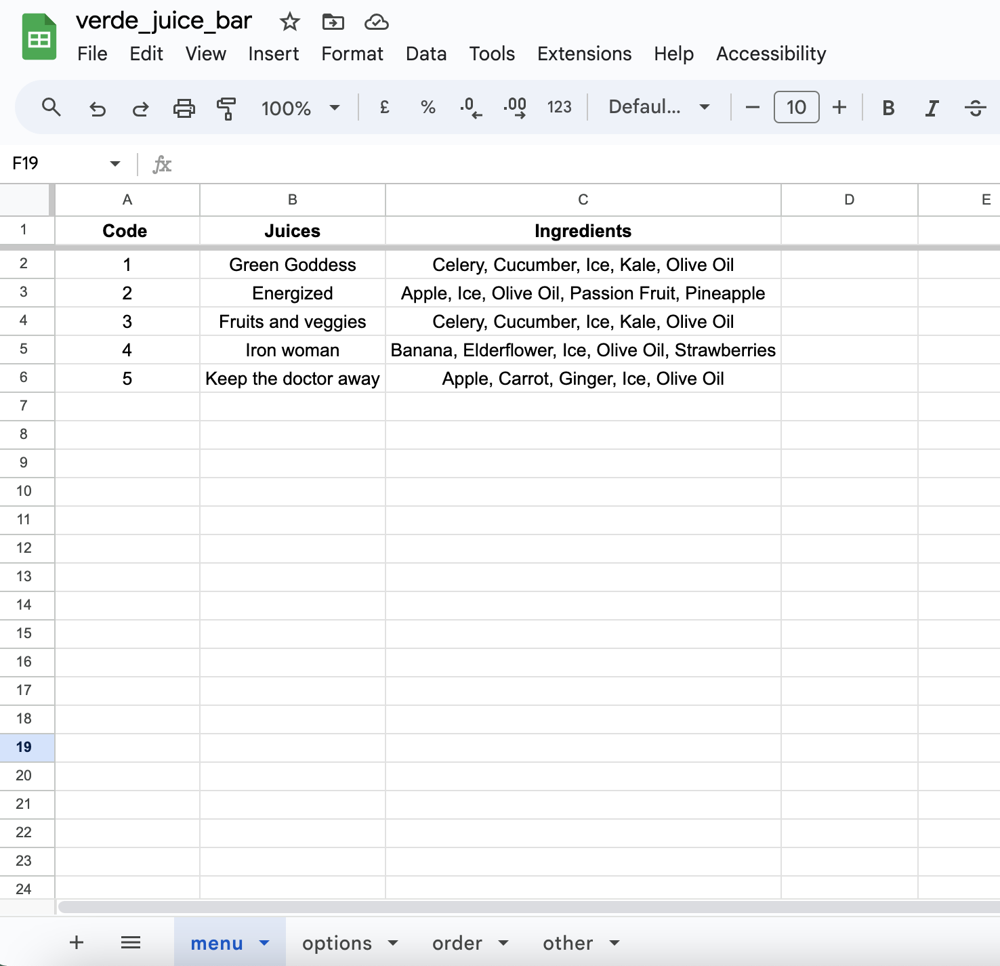
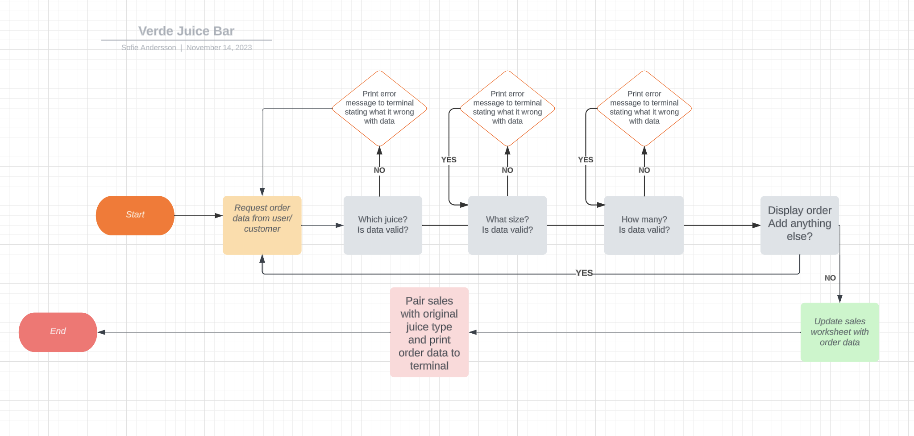
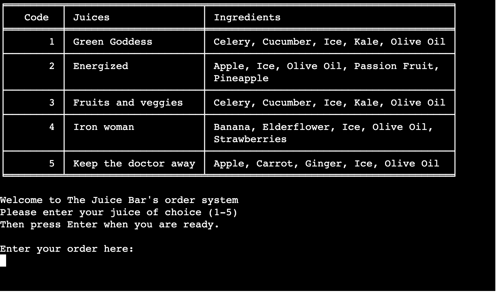
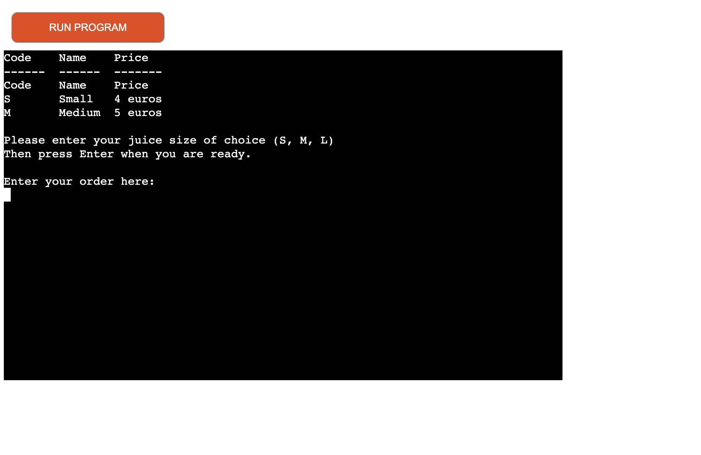
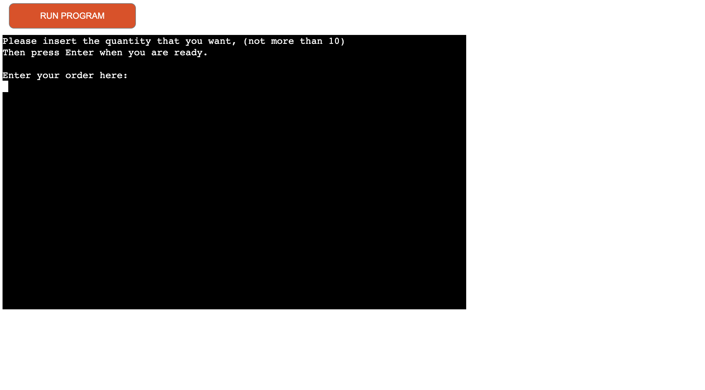
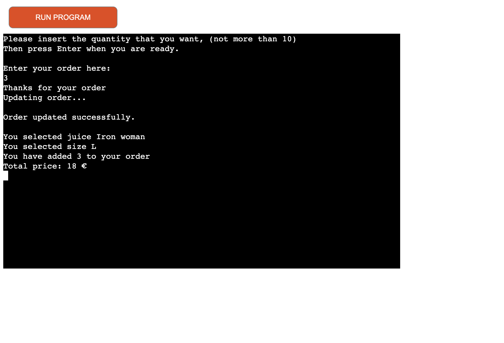
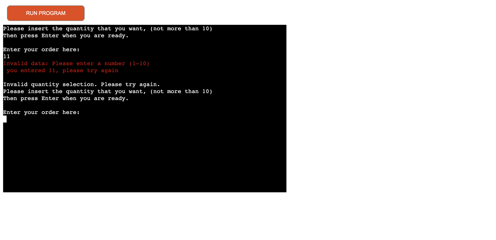
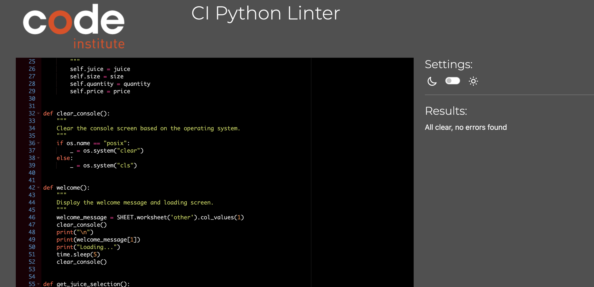
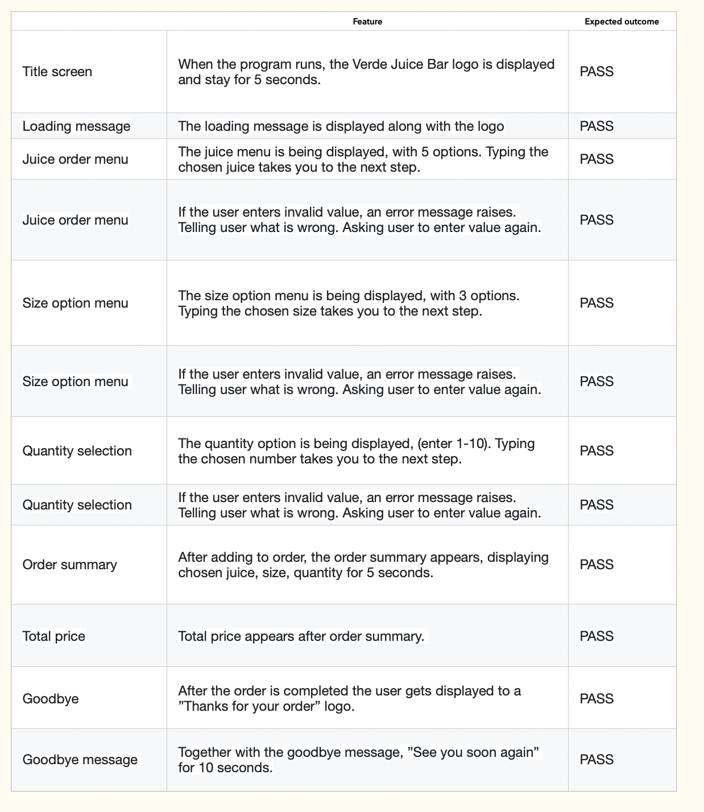
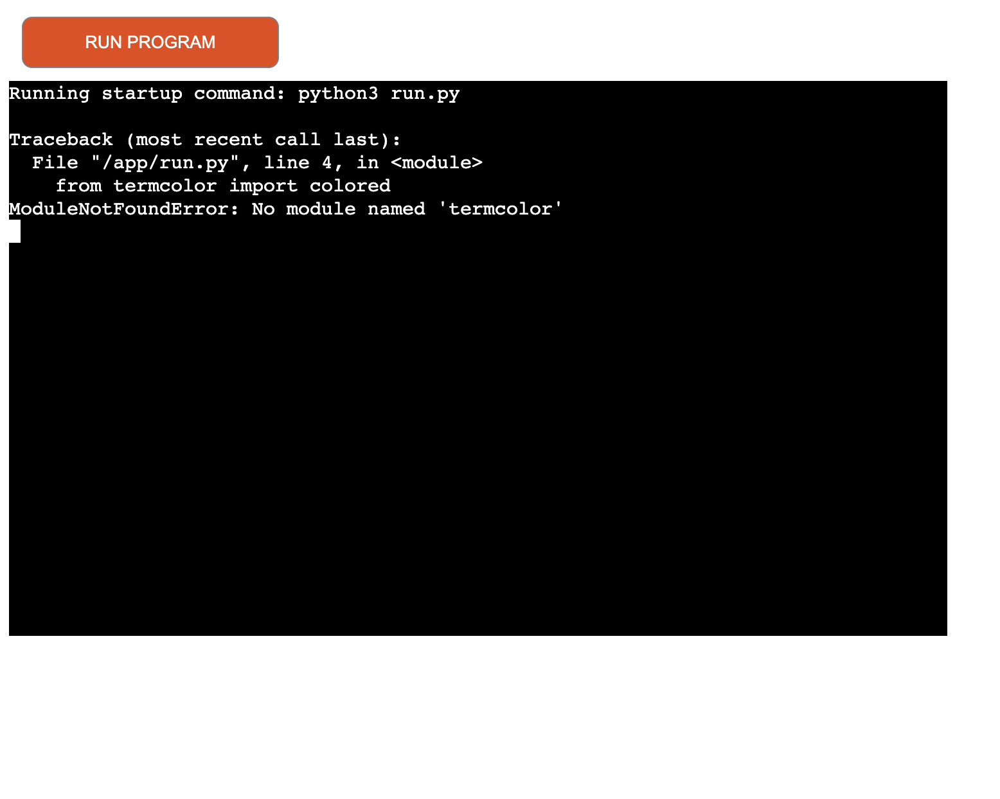

**Verde Juice Bar - Portfolio project 3**

I have created an order system for the fictional juice bar called Verde Juice Bar.  The main purpose of this program is to facilitate the process of taking orders by introducing a system that automatically populates a google spreadsheet with data about each order for better monitoring. Verde Juice Bar's order system was created entirely with Python and can be used through the terminal implemented with the Code Institute Python Template.

[Link to the program](https://verde-juice-bar-34673e70c54d.herokuapp.com/)

## Contents

* [UX](#ux)
	* [Project Goals](#project-goals)
	* [User Stories](#user-stories)
	* [Data Model](#data-model)
	* [Flowchart](#flowchart)

* [Features](#features)
	* [Existing Features](#existing-features)
	* [Title screen](#title-screen)
	* [Menu](#menu)
	* [Size options](#size-options)
	* [Add quantity](#add-quantity)
	* [Order summary](#order-summary)
	* [Goodbye message](#goodbye-message)
	* [Invalid data](#invalid-data)

* [Technologies used](#technologies-used)
	* [Languages](#languages)
	* [Frameworks, Libraries and Programmes](#framework)

* [Testing](#testing)
	* [User Stories Testing](#user-stories-testing)
	* [Code Validation](#code-validation)

* [Feature Testing](#feature-testing)

* [Bugs](#bugs)

* [Deployment](#deployment)

* [Code Validation](#code-validation)

* [Credits](#credits)
	* [Content](#content)
	* [Media](#media)
	* [Code](#code)

* [Acknowledgments](#acknowledgements)

## UX

### Project Goals

- The program should be easy and intuitive to navigate
- Collect user's order
- The information that appears on the screen should be relevant for each step of the order 
- If invalid values are being entered, user should be told what's wrong
- Instructions should appear to support the user in what values to enter
- The program should update the Orders data sheet with the right values
- Store data in a Google sheet
- The order content and price has to be displayed to the user before the order is finished
- Show the options and order summary in a tidy and clear way

### User Stories

- As a user, I would like to understand the purpose of the app
- As a user, I want to see information about the juice options that the restaurant offer  
- As a user, I want to be able to choose the size for each juice
- As a user, I want to be able to choose the quantity for each juice
- As a user, I want to see the order summary and the total price

### Data Model

The program uses a Google sheet to store the information collected from the order program. 

The welcome message and goodbye message are also stored in the Google sheet.

This is the Google sheet used to store the data.

  

### Flowchart

[Lucidchart](https://www.lucidchart.com/pages/sv/landing?utm_source=google&utm_medium=cpc&utm_campaign=_chart_sv_allcountries_mixed_search_brand_exact_&km_CPC_CampaignId=1705450947&km_CPC_AdGroupID=69165079880&km_CPC_Keyword=lucidchart&km_CPC_MatchType=e&km_CPC_ExtensionID=&km_CPC_Network=g&km_CPC_AdPosition=&km_CPC_Creative=331143569440&km_CPC_TargetID=kwd-33511936169&km_CPC_Country=1012436&km_CPC_Device=c&km_CPC_placement=&km_CPC_target=&gad_source=1&gclid=CjwKCAiAjfyqBhAsEiwA-UdzJNkln5Zq5SY8j8mUpMPu5oYo1czH5eN1L8eZeoFn11J85IN2aQLl4hoCp8IQAvD_BwE) was used to create the original flowchart for the project. During the development process, small adjustments and input validations were included that are not in the original flowchart.
 
 

## Features

### Existing Features  

The program has multiple features that were implemented to help the client and the restaurant owner as well. For simulating a real-life experience, the system is linked to a  **Google Spreedsheet**  that can be accessed  [here](https://docs.google.com/spreadsheets/d/1ebFoF1ArNrwraT9dMydFFJXQ1KuiSOgbEBwAHAtbK-Q/edit#gid=1680754323).

### Title Screen

This screen shows the name of the Juice bar and displays a loading text.

### Menu

This screen shows the Verde Juice bar menu, that gives the user five juice options. 

By adding multiple options the user always has a more complete experience allowing them to perform various actions in each menu.

### Size options

In this step the size options display and the user get to enter their selection.  

### Add quantity

Choosing a number for the quantity of juice the client wants is one, of the last steps in completing the order.

### Order summary

Before finishing the order, the user can see their order content and the final price. 

### Goodbye message

Thanks for your order message being displayed at the end of order.

### Invalid data 

Invalid data error messages are being displayed in a red color, making it easy for user to uderstand what's wrong. 

## Technologies Used

### Languages

-   Python

### Frameworks, Libraries and Programmes

-   [Lucid chart](https://www.lucidchart.com/pages/sv/landing?utm_source=google&utm_medium=cpc&utm_campaign=_chart_sv_allcountries_mixed_search_brand_exact_&km_CPC_CampaignId=1705450947&km_CPC_AdGroupID=69165079880&km_CPC_Keyword=lucidchart&km_CPC_MatchType=e&km_CPC_ExtensionID=&km_CPC_Network=g&km_CPC_AdPosition=&km_CPC_Creative=331143569440&km_CPC_TargetID=kwd-33511936169&km_CPC_Country=1012410&km_CPC_Device=c&km_CPC_placement=&km_CPC_target=&gad_source=1&gclid=Cj0KCQiApOyqBhDlARIsAGfnyMq78AEAjIVtKcA4T43kQD2D82Zj4wJd9hJspF4fH73UASzw1wiMonYaAh6xEALw_wcB): this was used to create a flowchart in the planning stage of the project.
-   [Colorama](https://pypi.org/project/colorama/): this was used to add colour to the terminal to improve UX and readability.
-   [Tabulate](https://pypi.org/project/tabulate/): this was used to display data in tables.
-   [Gspread](https://docs.gspread.org/en/v5.7.0/): this is the API for Google sheets, which stores the survey data.
-   [Codeanywhere](https://app.codeanywhere.com/): this was used to write, commit and push the code to GitHub.
-   [GitHub](https://github.com/): this was used to store the project and for version control.
-   [Heroku](https://dashboard.heroku.com/login): this was used to host and deploy the finished project.

## Testing

### User Stories Testing
-   As a user, I would like to understand the purpose of the program.
    -   The program welcomes the user to the Verde Juice Bar order system and shows readable instructions and maintains a smooth path through menus and questions.
-   As a user, I would like to be able to add juice, size and quantity to the order.
    -   The menus are designed to give these options to the user.
-   As a user, I would like to be able to review my order.
    -   The order summary is being displayed after adding juice to the order.
-   As a user, I would like see the total price of my order.
    -   This is being displayed after the order summary.

## Code Validation

This program was validated using the PEP8 tool provided by Code Institute with no errors.

    
There have been a persistent problem when using Codeanywhere code validation. Since it was not showing the same errors and warnings as the PEP8 tool from Code Institute. After the last mentor session with Rory Patrick Sheridan, he realized Python was not installed in Codeanywhere, and therefore not displaying properly and due to this I had several errors in PEP8 that had to be fixed in the end. 
    
## Feature Testing

I have manually tested the following features in Codeanywhere and in the Code Institute Heroku terminal. 

## Bugs

1.  The error message, The ModelNotFoundError appeared after deploying to Heroku. I had not considered to update the requirements.txt after installing term color. This was solved with Run ‘pip3 freeze > requirements.txt’, making sure the list of dependencies was updated.

2. In connection with Codeanywhere's updates being made Tuesday 21/11- Thursday 23/11 I had problems with pushing to Github. I had to contact Codeanywhere support, who confirmed this was a problem, after some guidance this was solved but, but unfortunately code changes were lost before realizing the problem. After this I made sure to check in Github several times during the day, to check that the commits had been successful. 

3. I had problems with getting the size option menu to display correctly inside the grid. It was showing the headlines two times, leaving out the Large option to be displayed. I managed to fix the full menu being displayed, but had to remove the table design being used, since I could not get it to work otherwise. 

## Future implementation 

There a few features I would like to add to the program in the future. My original intention was for the user to being able to add to the order. 
I was not able to get this function to work, and realized I then had to add a customer number or id, to be able to display only the order rows connected to the specific user together, since all orders are being added to the worksheet. 

I would also like the user to being able to restart the program, and make a special order, choosing ingredients from a list of menu and creating their own juice order. 

## Deployment

The program was developed in Codeanywhere. It was then committed and pushed to GitHub. The project was deployed to Heroku using the Code Institute Python Terminal for display purposes. Deployment to Heroku was completed using the following steps:

1.  Run 'pip3 freeze > requirements.txt' in the terminal to add a list of dependencies to requirements.txt
2.  Commit these changes and push to GitHub.
3.  Open and login to  [Heroku](https://id.heroku.com/login).
4.  From the dashboard, click 'New', then click 'Create new app'.
5.  Enter the App name, choose a region, then click 'Create app'.
6.  Navigate to the 'Settings' tab.
7.  Within 'Settings', navigate to 'Config Vars'.
8.  Two config vars need to be added using the following 'KEY' and 'VALUE' pairs:
    1.  KEY = 'CREDS', VALUE = Copy and paste the entire contents of the creds.json file into this field. Then click 'Add'.
    2.  KEY = 'PORT', VALUE = '8000'. Then click 'Add'.
9.  Within 'Settings', navigate to 'Buildpack'.
10.  Click 'Add buildpack'. Select 'Python', then click 'Save changes'.
11.  Click 'Add buildpack' again. Select 'nodejs', then click 'Save changes'.
12.  Navigate to the 'Deploy' tab.
13.  Within 'Deploy', navigate to 'Deployment method'.
14.  Click on 'GitHub'. Navigate to 'Connect to GitHub' and click 'Connect to GitHub'
15.  Within 'Connect to GitHub', use the search function to find the repository to be deployed. Click 'Connect'.
16.  Navigate to either 'Automatic Deploys' or 'Manual Deploys' to choose which method to deploy the application.
17.  Click on 'Enable Automatic Deploys' or 'Deploy Branch' respectively, depending on chosen method.
18.  Once the app is finished building, a message saying 'Your app was successfully deployed' will appear.
19.  Click 'View' to see the deployed app.

## Credits

### Content

All content was created and written by Sofie Andersson, the developer. The juice menu was inspired by the juice menu at [Joe & the Juice](https://www.joejuice.com/store/4f08d303-6c6d-4397-b3ba-e0db2a4c6664)

### Media

[Patorjk ASCII Art Generator](http://patorjk.com/software/taag/#p=display&f=Graffiti&t=Type%20Something%20)  This web tool was used to generate the welcome and goodbye messages.

### Code 

Take input from user:
[https://www.geeksforgeeks.org/how-to-take-only-a-single-character-as-an-input-in-python/](https://www.geeksforgeeks.org/how-to-take-only-a-single-character-as-an-input-in-python/)

Insert tabulate: 
[https://pypi.org/project/tabulate/](https://pypi.org/project/tabulate/)

Clear printed text in Python:
[https://stackoverflow.com/questions/19596750/is-there-a-way-to-clear-your-printed-text-in-python](https://stackoverflow.com/questions/19596750/is-there-a-way-to-clear-your-printed-text-in-python)

Clear screen in Python:
https://www.geeksforgeeks.org/clear-screen-python/ 

How to take a single character input:
[https://www.geeksforgeeks.org/how-to-take-only-a-single-character-as-an-input-in-python/](https://www.geeksforgeeks.org/how-to-take-only-a-single-character-as-an-input-in-python/)

Create Python classes: 
[https://www.youtube.com/watch?v=pnWINBJ3-yA](https://www.youtube.com/watch?v=pnWINBJ3-yA)

Limiting input:
[https://stackoverflow.com/questions/8761778/limiting-python-input-strings-to-certain-characters-and-lengths](https://stackoverflow.com/questions/8761778/limiting-python-input-strings-to-certain-characters-and-lengths)

Install Colorama library:
[https://pypi.org/project/colorama/](https://pypi.org/project/colorama/)

Print colored text in Python:
[https://www.studytonight.com/python-howtos/how-to-print-colored-text-in-python](https://www.studytonight.com/python-howtos/how-to-print-colored-text-in-python)

Create Ascii font in Python:
[https://www.youtube.com/watch?v=9RjH4-kYPWw](https://www.youtube.com/watch?v=9RjH4-kYPWw)

[https://www.youtube.com/watch?v=apACNr7DC_s](https://www.youtube.com/watch?v=apACNr7DC_s)

Insert welcome ascii logo:
[https://github.com/Moonchichiii/battleship_project3/blob/main/run.py](https://github.com/Moonchichiii/battleship_project3/blob/main/run.py)

Create ascii logo:
[https://www.asciiart.eu/text-to-ascii-art](https://www.asciiart.eu/text-to-ascii-art)

Print ascii logo:
[https://stackoverflow.com/questions/23623288/print-full-ascii-art](https://stackoverflow.com/questions/23623288/print-full-ascii-art)

Install Pyfiglet:
[https://pypi.org/project/pyfiglet/0.7/](https://pypi.org/project/pyfiglet/0.7/)

Install Termcolor:
[https://pypi.org/project/termcolor/](https://pypi.org/project/termcolor/)

Make error message text red:
[https://pythonhow.com/how/print-coloured-text-on-the-terminal/#:~:text=To%20print%20coloured%20text%20on%20the%20terminal%20in%20Python%2C%20you,such%20as%20bold%20and%20underline](https://pythonhow.com/how/print-coloured-text-on-the-terminal/#:~:text=To%20print%20coloured%20text%20on%20the%20terminal%20in%20Python%2C%20you,such%20as%20bold%20and%20underline)

Install time in Python:
https://pypi.org/project/TIME-python/#:~:text=Installing%20%26%20importing&text=The%20TIME%20package%20is%20available,date%20with%20the%20latest%20changes.&text=To%20upgrade%20the%20current%20version,install%20TIME%2Dpython%20%2D%2Dupgrade%20.&text=All%20available%20versions%20are%20listed%20in%20PyPI. 

Use sleep function:
https://www.programiz.com/python-programming/time/sleep#google_vignette

Install and create clear console function:
https://www.geeksforgeeks.org/clear-screen-python/ 

Calculate price in Python:
https://stackoverflow.com/questions/39627886/desk-price-calculation-in-pyt

ChatGpt was used for checking and help on how to make function get_orders to work. 
https://chat.openai.com/ 

American pizza has been an inspiration for overall project idea, and parts of code have been used. 
[https://github.com/useriasminna/american_pizza_order_system/blob/main/run.py#L88](https://github.com/useriasminna/american_pizza_order_system/blob/main/run.py#L88)

[https://american-pizza-order-system.herokuapp.com](https://american-pizza-order-system.herokuapp.com)

Holiday Survey, parts of code from this program have been used. 
https://github.com/MiguelSanLeon/holidays-survey/blob/main/README.md 

https://holiday-survey-87184cd3dbf0.herokuapp.com 

## Acknowledgements

Many thanks to my two mentors for this project, Luke Buchanan and Rory Patrick Sheridan, for pushing me in the right direction and giving new perspectives, and help along the way. 
